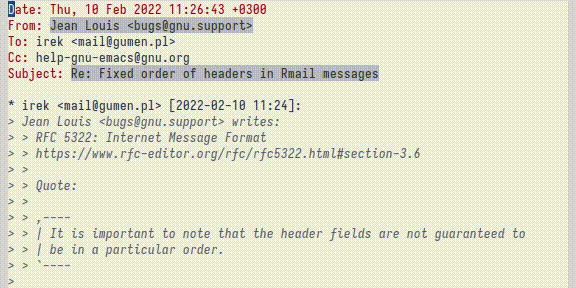

# Rmail ordered headers

Control order of headers in Emacs Rmail messages buffer by setting
`rmail-ordered-headers` variable.  Normally each message has headers
in different order ([detail explanation][1]).

[1]: https://github.com/ir33k/rmail-ordered-headers/blob/master/rmail-ordered-headers.el#L23
